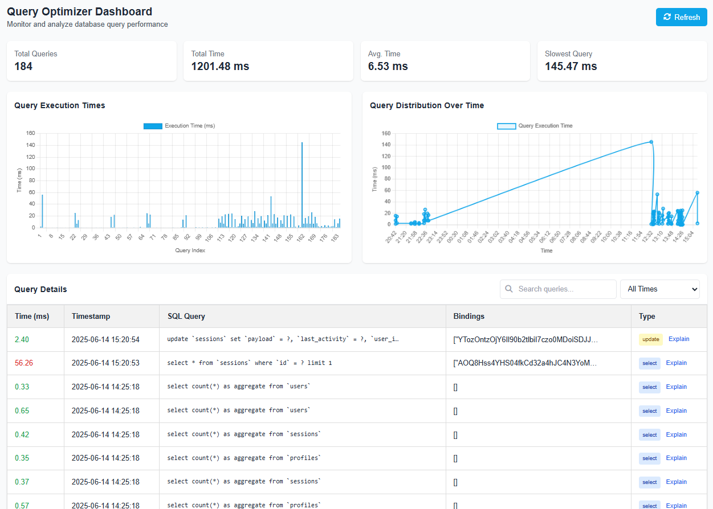
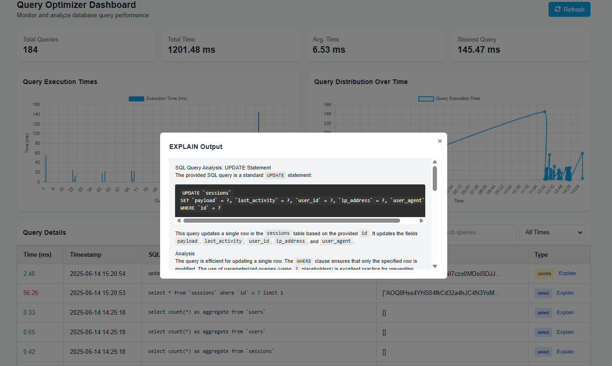

## Laravel Query Optimizer

The **Laravel Query Optimizer** is a package designed to monitor, analyze, and optimize database query performance in Laravel applications. It provides tools to log query execution details, analyze performance metrics, and suggest improvements through a user-friendly dashboard and API endpoints. The package leverages Doctrine DBAL for advanced query analysis and integrates seamlessly with Laravel's service provider architecture.

### Demos

Here are some demo images showcasing the Laravel Query Optimizer package:





### Features

* **Query Logging**: Records SQL queries, their bindings, execution time, and timestamps.
* **Performance Dashboard**: Visualizes query statistics, execution times, and query distribution.
* **API Endpoints**: Retrieve query metrics and get detailed query explanations using an external AI service (Gemini API).
* **Console Commands**: View and clear query statistics from the command line.
* **Customizable Configuration**: Configure log paths, API keys, and other settings.
* **Doctrine DBAL Integration**: Offers advanced database schema analysis for query optimization.

### Requirements

* PHP >= 8.0
* Laravel >= 8.x
* Doctrine DBAL
* Supported database drivers: MySQL, PostgreSQL, SQLite, SQL Server

### Installation

1. **Install via Composer**:

   ```bash
   composer require vendor/query-optimizer
   ```
2. **Publish Configuration**:

   ```bash
   php artisan vendor:publish --tag=config
   ```

   This will copy the configuration file to `config/queryoptimizer.php`.
3. **(Optional) Publish Views**:

   ```bash
   php artisan vendor:publish --tag=queryoptimizer-views
   ```

   This will copy dashboard views to `resources/views/vendor/queryoptimizer`.
4. **(Optional) Publish Assets**:

   ```bash
   php artisan vendor:publish --tag=assets
   ```

   This will copy JavaScript assets to `resources/js/queryoptimizer`.
5. **Configure Gemini API Key** (for query explanations) in `config/queryoptimizer.php`:

   ```php
   return [
       'log_path'       => storage_path('logs/query_optimizer.log'),
       'gemini_api_key' => env('GEMINI_API_KEY', ''),
   ];
   ```

   Then add `GEMINI_API_KEY` to your `.env` file.

### Configuration

Edit `config/queryoptimizer.php` to customize:

* `log_path`: Path for query logs (default: `storage/logs/query_optimizer.log`).
* `gemini_api_key`: API key for Gemini AI service.
* Other settings as needed.

### Usage

#### Dashboard

Visit `/query-optimizer/dashboard` to see:

* Total queries executed
* Total & average execution time
* Slowest query details
* Execution time charts
* Query distribution over time
* Detailed logs with filters (all, fast, medium, slow)

#### API Endpoints

Under `/api/query-optimizer`:

* **GET** `/metrics` – Returns performance statistics.
* **POST** `/explain` – Analyzes an SQL query and returns an explanation (requires Gemini API key).

Example:

```bash
curl -X POST http://your-app.com/api/query-optimizer/explain \
  -H "Content-Type: application/json" \
  -d '{"sql": "SELECT * FROM users WHERE created_at > NOW()"}'
```

#### Console Commands

* **Show Stats**:

  ```bash
  php artisan query-optimizer:stats
  ```
* **Clear Stats**:

  ```bash
  php artisan query-optimizer:clear-stats
  ```

### How It Works

1. **Service Provider**: Registers `QueryAnalyzer`, sets up routes, views, and commands.
2. **Query Logging**: `QueryLogger` class logs details to the configured file.
3. **Analysis**: `QueryAnalyzer` tracks queries, manages stats, and integrates Doctrine DBAL for schema insights.
4. **Dashboard**: `DashboardController` renders a Blade view (`dashboard.blade.php`) for metrics.
5. **API**: `ApiController` handles metrics retrieval and query explanations via Gemini.
6. **Console**: `ShowStats` & `ClearStats` commands manage stats from the CLI.

### Customization

* **Views**: Modify published Blade templates in `resources/views/vendor/queryoptimizer`.
* **JavaScript**: Extend assets in `resources/js/queryoptimizer`.
* **Config**: Adjust `config/queryoptimizer.php` as needed.

### Troubleshooting

* **Empty Dashboard**: Check that the `log_path` file is writable and receiving logs.
* **API Errors**: Verify the Gemini API key and network connectivity.
* **DBAL Issues**: Ensure correct database configuration and driver.

### Contributing

Contributions are welcome! Please submit a pull request or open an issue on GitHub.

### License

Open-source under the [MIT License](https://opensource.org/licenses/MIT).
